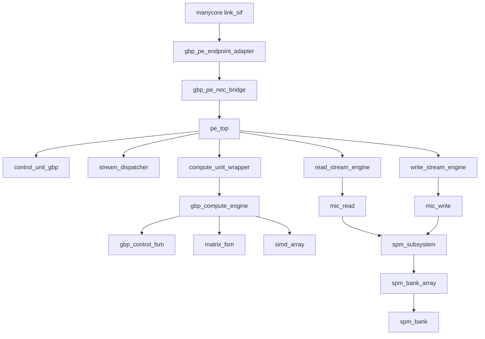

# GBP RTL System Top-Down 设计总文档

日期：2026-04-10
状态：首版
适用范围：`v/gbp_pe/*` 与其 manycore/Verilator 集成路径

## 1. 文档目标
- 从系统顶层维护 GBP RTL 的模块分层、模块职责、关键接口和时序规则。
- 作为后续所有 RTL 修改、白盒调试、Verilator 测试补齐时的统一参照。

## 2. 输入来源
- RTL：
  - `v/gbp_pe/gbp_pe.sv`
  - `v/gbp_pe/pe_top.sv`
  - `v/gbp_pe/interfaces.sv`
  - `v/gbp_pe/control_unit_gbp.sv`
  - `v/gbp_pe/read_stream_engine.sv`
  - `v/gbp_pe/write_stream_engine.sv`
  - `v/gbp_pe/spm_subsystem.sv`
  - `v/gbp_pe/compute/*`
- 既有专题文档：
  - `v/gbp_pe/PE_L1_SIGNAL_FLOW.md`
  - `v/gbp_pe/CONTROL_COMPUTE_ABSTRACTION_DRAFT.md`
  - `v/gbp_pe/DATA_LAYOUT_DRAFT.md`
  - `v/gbp_pe/GBP_DATA_STORAGE_SUMMARY.md`
- 审计记录：
  - `evidence/2026-03-27_gbp_pe_mesh_whitebox_dpi_spm.md`
  - `evidence/2026-04-09_gbp_rtl_verilator_review.md`

## 3. 系统边界

### 3.1 顶层外部边界
当前 manycore 系统视角下，`gbp_pe` 负责：
- 接收/发送 manycore `link_sif`
- 把 NoC 请求翻译为：
  - sideband compute 命令
  - ingress SPM 写入意图
- 在 PE 完成一轮本地 compute 后，向 manycore 发回完成通知包

### 3.2 顶层结构

## 4. 分层定义

| 层级 | 模块 | 作用 | 当前状态 |
|---|---|---|---|
| L0 manycore 壳层 | `gbp_pe` | manycore 接入、NoC/PE 边界、完成包回传 | 主路径 |
| L1 PE 系统层 | `pe_top` | 组装 control/stream/compute/spm 子系统 | 主路径 |
| L2 调度与流层 | `control_unit_gbp`、`stream_dispatcher`、`read_stream_engine`、`write_stream_engine` | 调度、descriptor 发射、数据流搬运 | 主路径 |
| L2 NoC/端点适配层 | `gbp_pe_endpoint_adapter`、`gbp_pe_noc_bridge` | packet/link/本地 sideband/ingress 翻译 | 主路径 |
| L2 本地存储层 | `spm_subsystem`、`spm_bank_array`、`spm_bank`、`spm_*_arbiter`、`mic_*` | SPM 读写仲裁、bank 路由、beat 存取 | 主路径 |
| L2 计算包装层 | `compute_unit_wrapper` | 对接 `pe_top` 与 `gbp_compute_engine` | 主路径，但包含遗留兼容逻辑 |
| L3 计算执行层 | `gbp_compute_engine`、`gbp_control_fsm`、`matrix_fsm`、`simd_array`、`staging_buffer`、`agu` | 节点计算微流程、矩阵/向量操作、流缓存 | 主路径，但部分功能未完成 |
| 遗留层 | `control_unit.sv`、`compute_unit.sv`、`v/pe/gbp_pe.sv` | 旧接口或旧实验实现 | 非权威主路径 |

## 5. 模块职责与接口摘要

### 5.1 manycore 边界层

| 模块 | 主要职责 | 关键输入 | 关键输出 | 时序/握手要点 |
|---|---|---|---|---|
| `gbp_pe` | manycore tile 内的 GBP PE 壳层 | `link_sif_i`、`barrier_*`、`my_x/y`、`pod_x/y`、可选 `wb_cmd_*` | `link_sif_o`、`cmd/rsp` 到 `pe_top`、完成通知包 | 对外 NoC 流控由 endpoint adapter 管；对内 sideband 命令为单 inflight 模式 |
| `gbp_pe_endpoint_adapter` | manycore endpoint/link 与本地 core request/return 的适配 | `link_sif_i`、`out_packet_i/out_v_i` | `core_req_*`、`returned_*`、`link_sif_o` | `out_v_i` 仅在 `out_credit_or_ready_o=1` 时可被接收；返回路径有 credit 反馈 |
| `gbp_pe_noc_bridge` | 把本地 core_req 译码成 sideband 命令或 ingress 写意图 | `core_req_*` | `sideband_cmd_*`、`ingress_intent_*`、`core_rsp_*` | 请求消费事件为 `core_req_v_i && core_req_yumi_o`；响应以 `core_rsp_v_o` 返回 |

### 5.2 PE 系统层

| 模块 | 主要职责 | 关键输入 | 关键输出 | 时序/握手要点 |
|---|---|---|---|---|
| `pe_top` | 串接 control/stream/compute/spm，形成本地 PE 数据通路 | `cmd_valid_i/cmd_kind_i/cmd_txn_id_i`、`ingress_wr_*` | `cmd_ready_o/rsp_done_o/rsp_error_o`、`rd_req_*`、`wr_req_*`、`compute_*` | 外部命令接收事件为 `cmd_valid_i && cmd_ready_o`；当前 sideband 与 control 共享 compute 资源 |

### 5.3 调度与流层

| 模块 | 主要职责 | 关键接口 | 时序/握手要点 | 当前说明 |
|---|---|---|---|---|
| `control_unit_gbp` | 基于 META 调度 variable/factor 任务，驱动 compute | `control_dispatch_if`、`control_compute_if`、`stream_control_if_*`、`meta_*` | `cmd_accept = cmd_valid && cmd_ready`；`commit = rsp_done && inflight_match` | 当前权威调度器 |
| `stream_dispatcher` | 把 control 发来的 descriptor 分发到 read/write 流 | `control_dispatch_if`、`stream_dispatcher_if_*` | `valid/ready` 标准握手 | 当前 `write` 路径在 `pe_top` 中有一个 unused 实例，需持续审视 |
| `read_stream_engine` | 按 descriptor 触发 SPM 读，把数据流向 compute，同时 sticky META | `stream_dispatcher_if`、`read_stream_if`、`mic_spm_arbiter_if` | 只有 descriptor、地址 FIFO、MIC 都空闲时才应接受新 descriptor | 近期修过 META 污染与 descriptor 提前接收问题 |
| `write_stream_engine` | 接收 compute 输出流并按 descriptor 写回 SPM | `write_stream_if`、`stream_dispatcher_if`、`mic_spm_arbiter_wr_if` | `valid/ready` 与写请求 ready 串联 | 长程背压仍需持续观测 |
| `mic_read` | 将读 descriptor/地址流变成 SPM 读请求 | `mic_spm_arbiter_if` | `busy_o` 应反映是否仍有未排空响应 | 与 `read_stream_engine` 时序耦合很强 |
| `mic_write` | 将写 payload 变成 SPM 写请求 | `mic_spm_arbiter_wr_if` | `addr/data` 都有效才可发请求 | 用于 ingress 和 compute 写回两条路径 |

### 5.4 本地存储层

| 模块 | 主要职责 | 关键接口 | 时序/握手要点 | 当前说明 |
|---|---|---|---|---|
| `spm_subsystem` | 统一读写接口进 bank 阵列，按地址 bank bits 动态路由 | `rd_if[]`、`wr_if[]` | `wr_ready` 与 `rd_rsp_valid` 必须从实际选中 bank 返回 | 已从静态 bank 绑端口改为动态按地址路由 |
| `spm_bank_array` | 管理多 bank 实例 | `spm_bank_if` | 同周期支持并行 bank 访问取决于 bank 分布 | 当前为 SPM 物理展开层 |
| `spm_bank` / `spm_bank_dpi` | 单 bank 存储实现 / 白盒 DPI-backed 实现 | `spm_bank_if` | 默认主路径与白盒路径 filelist 不同 | 白盒用 `spm_bank_dpi.sv` |
| `spm_rd_arbiter` / `spm_wr_arbiter` / `spm_arbiter` | 读写仲裁辅助 | 内部仲裁接口 | 需保证请求不会跨 bank 串扰 | 仍属关键时序点 |
| `addr_fifo` / `data_fifo` | ingress/stream 内部排队 | `valid/ready/unqueue` | FIFO 不得与 descriptor/sticky META 构成环形阻塞 | 已用于 ingress 路径 |

### 5.5 计算层

| 模块 | 主要职责 | 关键接口 | 时序/握手要点 | 当前说明 |
|---|---|---|---|---|
| `compute_unit_wrapper` | `pe_top` 与 `gbp_compute_engine` 的桥接 | `control_compute_if` 风格离散端口、`read_stream_if`、`write_stream_if` | `compute_done_o` 为原始完成，`rsp_done_o` 为写回接受后的完成 | 仍保留 legacy passthrough 占位逻辑 |
| `gbp_compute_engine` | GBP 节点计算执行引擎 | 内部接 `gbp_control_fsm`、`matrix_fsm`、`simd_array` | 单命令执行到 `compute_done_o` | 除法路径仍未接通 |
| `gbp_control_fsm` | 计算微流程控制 | `cmd_valid/ready`、矩阵操作控制 | 控制矩阵/向量操作阶段推进 | factor cavity 部分仍是 placeholder |
| `matrix_fsm` | 矩阵算子时序器 | 矩阵读写控制 | 以内部阶段推进为主 | 主路径 |
| `simd_array` | 标量/向量基础运算 | `op_*_en`、`data_a/b_i` | 有效输出以 `valid_o` 指示 | `op_div_en` 仍固定为 0 |
| `staging_buffer` | 中间结果缓存 | 内部接口 | 作为 compute 内部节拍缓冲 | 主路径 |
| `agu` | 地址生成 | descriptor/步长/长度 | 按 beat 生成地址 | 主路径 |

## 6. 权威接口清单

### 6.1 `control_dispatch_if`
- 位置：`interfaces.sv`
- 作用：`control_unit_gbp -> stream_dispatcher`
- 关键信号：
  - `valid`
  - `ready`
  - `mode`
  - `node_address`
  - `xfer_bytes`
  - `addr_step_bytes`
  - `write`
- 时序规则：
  1. 接受事件：`valid && ready`
  2. `valid=1 && ready=0` 时，发送方必须保持 descriptor 稳定
  3. descriptor 仅在接受事件后允许切到下一条

### 6.2 `control_compute_if`
- 位置：`interfaces.sv`
- 作用：`control_unit_gbp -> compute_unit_wrapper`
- 关键信号：
  - `cmd_valid`
  - `cmd_ready`
  - `cmd_kind`
  - `cmd_txn_id`
  - `cmd_dofs`
  - `cmd_adj_count`
  - `cmd_msg_count`
  - `cmd_wr_addr`
  - `cmd_wr_xfer_bytes`
  - `done`
  - `rsp_done`
- 时序规则：
  1. 单 inflight
  2. 接受事件：`cmd_valid && cmd_ready`
  3. 完成提交事件：`rsp_done && inflight_match`
  4. `done` 表示原始 compute 完成，`rsp_done` 表示写回/持久化链接受完成

### 6.3 `stream_dispatcher_if`
- 位置：`interfaces.sv`
- 作用：`stream_dispatcher -> read_stream_engine/write_stream_engine`
- 关键信号：
  - `valid`
  - `ready`
  - `data`
- 时序规则：
  1. 标准 `valid/ready`
  2. `data` 在未握手前必须保持稳定
  3. read 与 write 两条路径必须各自独立计背压

### 6.4 `read_stream_if`
- 位置：`interfaces.sv`
- 作用：`read_stream_engine -> compute_unit_wrapper`
- 关键信号：
  - `valid`
  - `ready`
  - `data`
- 时序规则：
  1. 标准 `valid/ready`
  2. `read_stream_engine` 在 sticky META 模式下，不应把 META 响应继续压入普通 data path
- 不确定性：
  - 当前缺少明确断言文件；该规则来自现有 RTL 和白盒问题定位，不是单独形式化过的协议文档

### 6.5 `write_stream_if`
- 位置：`interfaces.sv`
- 作用：`compute_unit_wrapper -> write_stream_engine`
- 关键信号：
  - `valid`
  - `ready`
  - `data`
- 时序规则：
  1. 标准 `valid/ready`
  2. `rsp_done` 不能早于最终写回接受

### 6.6 `mic_spm_arbiter_if`
- 位置：`interfaces.sv`
- 作用：读流到 SPM
- 关键信号：
  - `spm_rd_req_valid`
  - `spm_rd_req_addr`
  - `spm_rd_req_bytes`
  - `spm_rd_rsp_valid`
  - `spm_rd_rsp_data`
- 时序规则：
  1. 读请求接受条件由下游实现定义，但读响应必须与所选 bank 的真实返回对齐
  2. 读响应不可被下一条 descriptor 的 META sticky 误消费

### 6.7 `mic_spm_arbiter_wr_if`
- 位置：`interfaces.sv`
- 作用：写流到 SPM
- 关键信号：
  - `spm_wr_req_valid`
  - `spm_wr_req_addr`
  - `spm_wr_req_data`
  - `spm_wr_req_wstrb`
  - `spm_wr_req_ready`
- 时序规则：
  1. 写请求接受事件：`spm_wr_req_valid && spm_wr_req_ready`
  2. bank 选择必须来自地址解码，不能静态绑端口号

### 6.8 manycore NoC 边界
- `link_sif_i/o`
  - manycore mesh 的 packet/credit 流控通道
- `core_req_*` / `core_rsp_*`
  - endpoint adapter 与 noc bridge 之间的本地请求/响应通道
- 时序规则：
  1. `core_req_v && core_req_yumi` 表示本地请求被消费
  2. `core_rsp_v` 表示桥接响应返回
  3. sideband 命令与 ingress 写意图都从 bridge 译码产生

## 7. 时序总规则

### 7.1 全局规则
1. 除 manycore link 层外，内部主协议统一按 `valid/ready` 或 `valid/yumi` 解释。
2. 所有发送方在 `valid=1` 且未被接收时，必须保持 payload 稳定。
3. 所有“完成”信号必须区分：
   - 原始计算完成
   - 写回/持久化完成
4. 调度状态变更只允许发生在两个边界事件：
   - 命令接受
   - 完成提交

### 7.2 当前明确的关键时序风险点
1. `read_stream_engine`
   - descriptor 接受时机
   - META sticky 与普通 data FIFO 的隔离
2. `spm_subsystem`
   - bank bits 动态路由
   - `ready/rsp` 返回必须来自实际选中 bank
3. `compute_unit_wrapper`
   - `compute_done_o` 与 `rsp_done_o` 不得重复等待或提前确认
4. `write_stream_engine`
   - 长程运行时背压是否阻断后续 `rsp_done`

## 8. 当前已知缺口

### 8.1 功能缺口
- `compute_unit_wrapper` 仍保留 legacy passthrough 占位逻辑
- `gbp_control_fsm` 的 factor cavity accumulation 仍未完整实现
- `gbp_compute_engine` 的除法通路未接通

### 8.2 测试缺口
- `nocbp_verilator` 中存在测错 DUT、wrapper 命名不一致、源码字符串扫描式“测试”
- 缺少一套可信的、直接绑定 `v/gbp_pe/*` 主路径的最小回归矩阵

### 8.3 状态界定
- 当前系统状态应定义为：
  - manycore 接入路径已基本成型
  - PE 内部调度/流/存储主链路可运行
  - 长程 GBP 正确性与完整计算闭环仍未达成

## 9. 遗留与非权威实现

| 路径 | 定位 | 当前策略 |
|---|---|---|
| `v/pe/gbp_pe.sv` | 旧实验模块 | 不作为当前主设计源；测试需显式隔离 |
| `v/gbp_pe/control_unit.sv` | 旧控制单元 | 保留但不作为当前调度权威 |
| `v/gbp_pe/compute_unit.sv` | 旧 compute 壳 | 保留但主路径已由 `compute_unit_wrapper` 替代 |

## 10. 维护要求
1. 每次改端口、改握手、改时序，必须同步更新本文件。
2. 每次新增“当前缺口”或“已修复主根因”，必须同步更新 `design/gbp_change_register.md`。
3. 任何回归结果若推翻本文件中的状态界定，必须先修正文档，再继续扩展实现。
